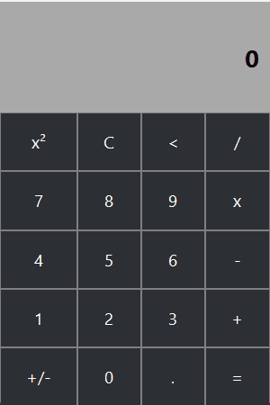

# 🧮 Python Calculator (Tkinter)

A simple calculator application built with Python using Tkinter, focused on clean architecture, code organization, and best practices.

---

## 🎬 Demo



---

## 🚀 Features

* Basic operations:

  * Addition (+)
  * Subtraction (-)
  * Multiplication (×)
  * Division (/)
* Square operation (x²)
* Sign toggle (+/-)
* Clear expression (C)
* Delete last character (<)
* Keyboard input support
* Responsive graphical interface

---

## 🧠 Project Structure

```
src/
 └── calculator/
     ├── logic.py     # Calculator logic
     └── UI.py        # Graphical interface (Tkinter)
assets/
 ├──img.png
 └──demo.gif
```

### 🔹 `logic.py`

Handles all core functionality:

* Expression manipulation
* Mathematical operations
* Input handling

### 🔹 `UI.py`

Responsible for the interface:

* Window creation
* Layout and buttons
* Keyboard events
* Display updates

---

## 🛠️ Technologies

* Python 3
* Tkinter (built-in GUI library)

---

## ▶️ How to Run

1. Clone the repository:

```
git clone https://github.com/your-username/your-repository.git
```

2. Navigate to the project folder:

```
cd your-repository
```

3. Run the application:

```
python src/calculator/UI.py
```

---

## 🎯 Purpose

This project was created to:

* Practice object-oriented programming
* Work with graphical interfaces in Python
* Apply separation between logic and UI
* Build a structured project for portfolio use

---


## 👤 Author

Luiz Henrique Martins Dias

---
